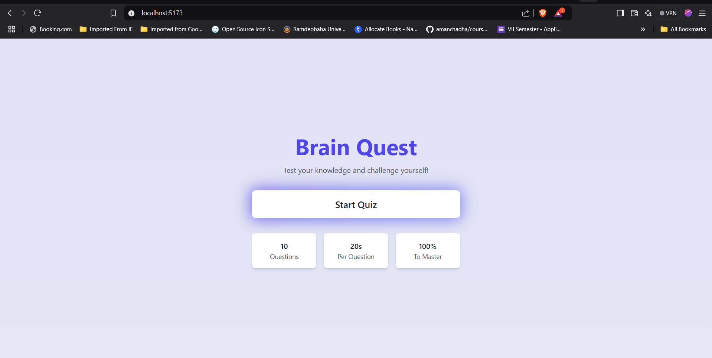
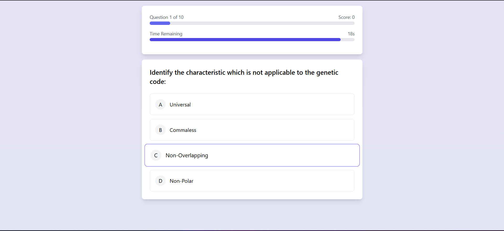
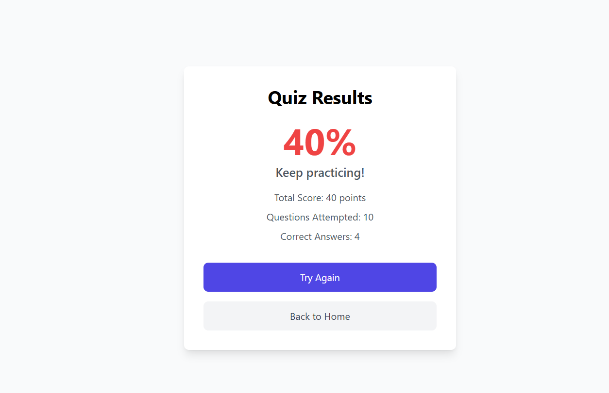

# Brain Quest - Interactive Quiz Application

A modern, interactive quiz application built with React and Tailwind CSS, featuring gamification elements and a responsive design.

## Features

- 🎯 Dynamic quiz questions with randomized order
- ⏱️ Timer for each question
- 📊 Real-time progress tracking
- 🎮 Gamification elements (streaks, animations)
- 📱 Responsive design
- 🎨 Modern UI with smooth transitions
- 🏆 Detailed results and feedback
- 🔄 Question randomization
- ✨ Interactive feedback animations

## Tech Stack

- React 18
- React Router v6
- Tailwind CSS
- Axios
- Vite
- Context API for state management

## Prerequisites

Before you begin, ensure you have the following installed:

- Node.js (v16 or higher)
- npm (v7 or higher)

## Installation

1. Clone the repository:

```bash
git clone <repository-url>
cd quiz-app
```

2. Install dependencies:

```bash
npm install
```

3. Start the development server:

```bash
npm run dev
```

4. Open your browser and navigate to:

```
http://localhost:5173
```

## Project Structure

```
quiz-app/
├── src/
│   ├── components/         # Reusable UI components
│   │   ├── Timer.jsx
│   │   ├── Progress.jsx
│   │   ├── StreakCounter.jsx
│   │   └── LoadingSpinner.jsx
│   ├── contexts/          # Global state management
│   │   └── QuizContext.jsx
│   ├── pages/            # Page components
│   │   ├── Home.jsx
│   │   ├── Quiz.jsx
│   │   └── Results.jsx
│   ├── services/         # API and external services
│   │   └── quizService.js
│   ├── hooks/            # Custom React hooks
│   │   └── useSound.js
│   ├── App.jsx          # Root component
│   └── main.jsx         # Entry point
```

## Features in Detail

### Home Page

- Engaging welcome screen
- Interactive start button
- Quiz information display

### Quiz Interface

- Timer for each question
- Progress tracking
- Streak counter for consecutive correct answers
- Visual feedback for answers
- Smooth transitions between questions

### Results Page

- Detailed score breakdown
- Performance feedback
- Option to retry quiz
- Animated score display

## Configuration

### Environment Variables

The application uses a proxy configuration for API calls. Update the `vite.config.js` file to modify API endpoints:

```javascript
server: {
  proxy: {
    '/api': {
      target: 'https://api.jsonserve.com',
      changeOrigin: true,
      rewrite: (path) => path.replace(/^\/api/, '')
    }
  }
}
```

### Quiz Settings

Modify quiz parameters in `src/services/quizService.js`:

- Number of questions
- Question randomization
- Timer duration

## Screenshots and Video Demonstration





video
